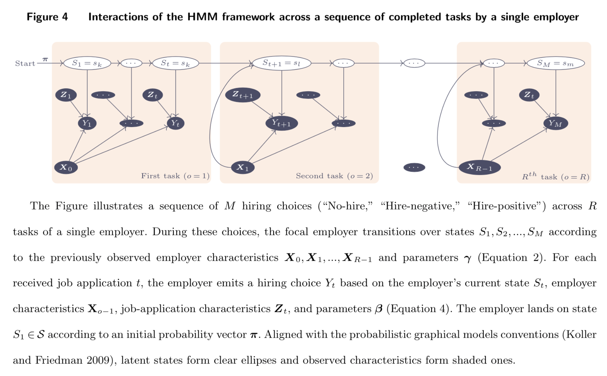
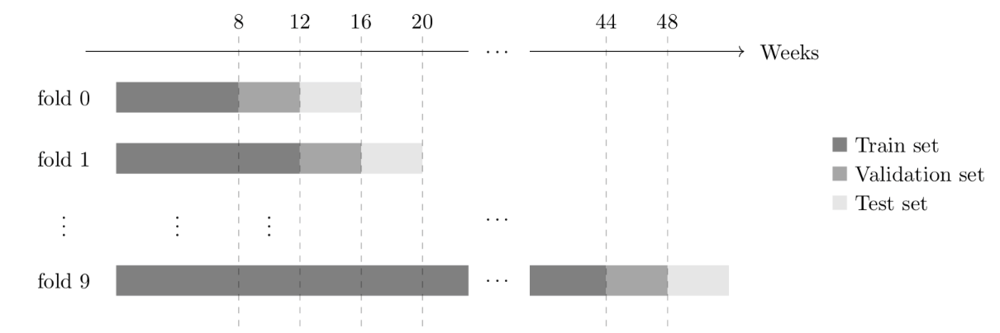

# GBU:  The Good, the Bad, and the Unhirable

> The code and dataset are posted for the review team of MS-INS-19-00471.  

## Implementation of different models

### The HMM implemntation

The implementation of the HMM can be found in two files:
* The **sklearn** extension class:  [hmm_gbu.py](src/python/hmm_gbu.py)
* The HMM functionality:  [hmm_functions.py](src/python/hmm_functions.py)

The conditional transitioning of Equation  (2) is implemented in XXXXX

### The LSTM implementation

The implementation of the LSTM models can be found in two files:
* The **sklearn** extension class:  [lstm_sklearn.py](src/python/lstm_sklearn.py)
* The HMM functionality:  [train_lstm.py](src/python/train_lstm.py)

### Implementation of single-assessment classifiers

The code for Logistic regression, Random forest, XGBoost, and SVM can be found in  [custom_util_functions.py](src/python/custom_util_functions.py)

### Implementation of many-assessment recommender systems

The code for the many-assessment recommender systems is in [many_assesment.ipynb](src/notebooks/many_assesment.ipynb)

The code for the Sahoo implmentation is in [train_sahoo](src/python/train_sahoo.py)

## Training

The training for all models happens in the following files:
* HMM, XGBoost, Random Forest, SVM, Logistic Regression: [train](src/python/train.py)
* LSTM:  [train_lstm.py](src/python/train_lstm.py)
* Sahoo: [train_sahoo](src/python/train_sahoo.py)
* SVD, CNN: [many_assesment.ipynb](src/notebooks/many_assesment.ipynb)

The trained process is described below:

To train these models, you can run the following files:

* [mainScript.sh](src/python/mainScript.sh) (requires cluster of nodes running Portable Batch System--PBS)
* [local_main_script.sh](src/python/local_main_script.sh)

This process will generate models and store them in the [trained_models](data/trained_models) directory. 
It will also post the results of the validation test inside the  [results_per_model](data/results_per_model) 

To generate a per-model results file that stores all the scores of the validation test you will need to run:

* [cat_results.sh](src/python/cat_results.sh) (on the remote server)
* [local_cat_results.sh](src/python/local_cat_results.sh)

## Results

The results are generated from the [analyze_results.ipynb](src/notebooks/analyze_results.ipynb) file.  

## Plots

All the plots are generate in the [R2-plots.html](src/R/R2-plots.html).

## Data

The raw dataset is here: [restaurant_ncv.csv](data/restaurant_ncv.csv)
